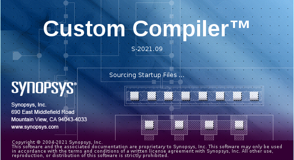
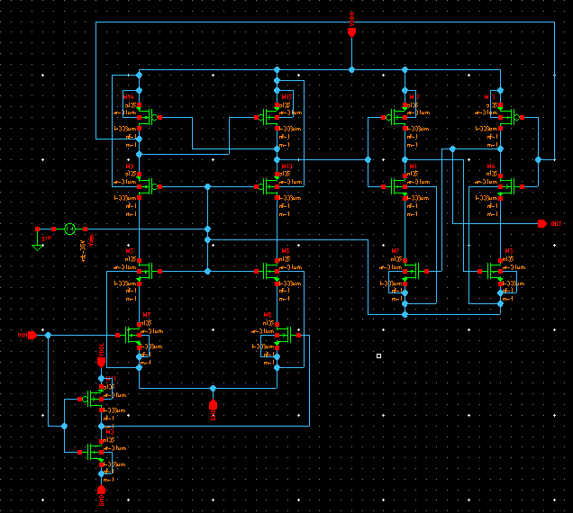

# HV_Tolerant_Level_Shifter_IITH_HACKATHON

This repository presents the design of High Voltage Tolerant Level Shifter implemented using Synopsis Custom Compiler on 28nm CMOS Technology.

# Table of Contents
   * [Abstract](#abstract)
   * [Synopsys Custom Compiler Tool Details](#Synopsys-Custom-Compiler-Tool-Details)
  * [Reference Circuit Details](#reference-circuit-details)
  * [Reference Circuit Diagram](#reference-circuit-diagram)
  * [Reference Circuit Waveform](#reference-circuit-waveform)
- [Simulation in Synopsys](#simulation-in-synopsys)
  * [Schematic](#schematic)
  * [Symbol](#symbol)
  * [Parameters set for Pulse Voltage Source for VIN](#parameters-set-for-pulse-voltage-source-for-vin)
  * [Parameters set for DC Voltage Source for VDDL](#parameters-set-for-dc-voltage-source-for-vddl)
  * [Parameters set for DC Voltage Source for VDDH](#parameters-set-for-dc-voltage-source-for-vddh)
  * [Parameters set for DC Voltage Source for Vbias](#parameters-set-for-dc-voltage-source-for-vbias)
  * [Transient Settings](#transient-settings)
  * [Netlist](#netlist)
  * [Waveform](#waveform)
  * [Conclusion](#conclusion)
  * [Acknowledgement](#Acknowledgement)
  * [References](#references)


## Abstract

A High-Voltage (HV)-Tolerant Level Shifter with combinational functionality is proposed based on conventional level shifters. This level shifter is tolerant to supply voltages higher than the process limit for individual CMOS transistors. The proposed HV level shifter is particularly useful when it is mandatory to constrain the output using a logic function during out of the normal mode periods (power-up, power-down, reset, etc.). This proposed level shifter is based on 28nm CMOS logic process. [1]

## Synopsys Custom Compiler Tool Details
The [Synopsys Custom Compiler™](https://www.synopsys.com/implementation-and-signoff/custom-design-platform/custom-compiler.html) design environment is a modern solution for full-custom analog, custom digital, and mixed-signal IC design. As the heart of the Synopsys Custom Design Platform, Custom Compiler provides design entry, simulation management and analysis, and custom layout editing features. It delivers industry-leading productivity, performance, and ease-of-use while remaining easy to adopt for users of legacy tools.

<p align="center">
</br>
  Figure : Synopsis Custom Compiler 
</p>

## Reference Circuit Details

The HV-tolerant level shifter with the topology shown in Fig. 1. This circuit shifts both voltage levels of Xn, from ground and VDDL to Vbias = VSS and VDDH, respectively. This is an HV-tolerant level shifter, because the input circuit (Mn1 to Mn4 and Mp1 to Mp4) is powered between VDDH and ground, whose difference is higher than Vmax. Mn3 and Mn4 act as voltage limiters when Mn2 or Mn1 are off, limiting voltages VA,AN < Vbias – Vtn. Similarly, Mp3 and Mp4 limit the voltages at X2 and X2n to values higher than Vbias + | Vtp |, thus protecting Mp1 and Mp2 from overvoltage. This inverter is powered between VDDH and Vbias, and its state is controlled by the intermediate output X2 signal, with voltage levels VDDH and Vbias + | Vtp |. As a consequence, the inverter’s input nMOS transistor VGS equals | Vtp | when X2 equals Vbias + | Vtp |. This VGS value does not guarantee that the nMOS transistor is off. To overcome this drawback, two solutions can be used: 1) modify the HV-Tolerant level-shifter circuit or 2) connect a conventional level shifter at the X2 intermediate output as shown in Fig 1.

The first solution requires an additional bias voltage source in the circuit valuing VSS - | Vtp |. This new bias voltage source replaces the Vbias = VSS only in the level shifter shown in Fig 1. The level shifter presented in the second solution, shifts the X2 lower signal level from VSS + | Vtp | to VSS. The added level shifter is shown in Fig 1 This solution is implemented because it avoids static current without requiring additional bias voltages.

The HV compatibility of the level shifter shown in Fig. 1 can be extended to higher voltage values by connecting Mn3 – Mn4 – Mp3 – Mp4 in a totem pole configuration biased with appropriate voltage values.

An HV-tolerant level shifter that shifts both digital levels from VDDH and Vbias = VSS to Vbias = VDD and ground, respectively, can easily be derived from the one shown in Fig.1 using a complementary circuit topology. Such complementary level shifter can be useful when designing the shoot- through control circuit presented in some integrated dc–dc converters[1]

## Reference Circuit Diagram
<p align="center">
</br>
  Fig. 1: HV Tolerant Level shifter Reference circuit Diagram 
</p>

## Reference Circuit Waveform
<p align="center">
</br>
  Fig. 2: HV Tolerant Level shifter Reference Waveforms Diagram 
</p>

# Simulation in Synopsys
## Schematic
<p align="center">
</br>
  Fig. 3: HV Tolerant Level shifter Schematic 
</p>

## Symbol
<p align="center">
</br>
  Fig. 4: HV Tolerant Level shifter using Symbol reference 
</p>
Note: To make the CMOS Level circuit more compatible and Industry ready a Symbol reference has been created. So, it makes easy whenever a testbench of different Parameters needs to be tested.

## Parameters set for Pulse Voltage Source for VIN
<p align="center">
</br>
  Fig. 5: Pulse Voltage Source Input VIN set at 1.05V 
</p>

## Parameters set for DC Voltage Source for VDDL
<p align="center">
</br>
  Fig. 6: Low VDD Supply set for the Inverter connection in the Circuit set at 1.05V 
</p>

## Parameters set for DC Voltage Source for VDDH
<p align="center">
</br>
  Fig. 7: High Voltage Supply given at VDDH to check the Level Shift set at 3.3V 
</p>

## Parameters set for DC Voltage Source for Vbias
<p align="center">
</br>
  Fig. 8: The Voltage Limiter (V-limit) from the Circuit Vbias is set at 0.6V
</p>

## Transient Settings
<p align="center">
</br>
  Fig. 9: The Transient Analysis inputs Run at 1us step with stop time 30us 
</p>

## Netlist
```
*  Generated for: PrimeSim
*  Design library name: sm_hvt_levelshifter
*  Design cell name: hvt_levelshifter_tb
*  Design view name: schematic
.lib 'saed32nm.lib' TT

*Custom Compiler Version S-2021.09
*Wed Feb 23 02:17:30 2022

.global gnd!
********************************************************************************
* Library          : sm_hvt_levelshifter
* Cell             : hvt_levelshifter
* View             : schematic
* View Search List : hspice hspiceD schematic spice veriloga
* View Stop List   : hspice hspiceD
********************************************************************************
.subckt hvt_levelshifter gnd_1 out vddh vddl vin
xm8 net85 net94 gnd_1 gnd_1 n105 w=0.1u l=0.03u nf=1 m=1
xm7 net83 vin gnd_1 gnd_1 n105 w=0.1u l=0.03u nf=1 m=1
xm6 net43 net44 net85 gnd_1 n105 w=0.1u l=0.03u nf=1 m=1
xm5 net39 net44 net83 gnd_1 n105 w=0.1u l=0.03u nf=1 m=1
xm4 out net103 net19 net44 n105 w=0.1u l=0.03u nf=1 m=1
xm3 net19 net51 net44 net44 n105 w=0.1u l=0.03u nf=1 m=1
xm2 net9 out net44 net44 n105 w=0.1u l=0.03u nf=1 m=1
xm1 net51 net63 net9 net44 n105 w=0.1u l=0.03u nf=1 m=1
xm0 net94 vin gnd_1 gnd_1 n105 w=0.1u l=0.03u nf=1 m=1
xm15 net63 net103 vddh vddh p105 w=0.1u l=0.03u nf=1 m=1
xm14 net103 net63 vddh vddh p105 w=0.1u l=0.03u nf=1 m=1
xm13 out net103 vddh vddh p105 w=0.1u l=0.03u nf=1 m=1
xm12 net51 net63 vddh vddh p105 w=0.1u l=0.03u nf=1 m=1
xm11 net94 vin vddl vddl p105 w=0.1u l=0.03u nf=1 m=1
xm10 net43 net44 net63 vddh p105 w=0.1u l=0.03u nf=1 m=1
xm9 net39 net44 net103 vddh p105 w=0.1u l=0.03u nf=1 m=1
vbias net44 gnd! dc=0.6
.ends hvt_levelshifter

********************************************************************************
* Library          : sm_hvt_levelshifter
* Cell             : hvt_levelshifter_tb
* View             : schematic
* View Search List : hspice hspiceD schematic spice veriloga
* View Stop List   : hspice hspiceD
********************************************************************************
xi0 gnd! out net8 net6 net10 hvt_levelshifter
v6 net8 gnd! dc=3.3
v5 net6 gnd! dc=1.05
v9 net10 gnd! dc=1.05 pulse ( 0 1.05 0 0.1u 0.1u 5u 10u )


.tran '1u' '30u' name=tran

.option primesim_remove_probe_prefix = 0
.probe v(*) i(*) level=1
.probe tran v(out) v(net10)

.temp 25


.option primesim_output=wdf


.option parhier = LOCAL


.end

```
## Waveform
<p align="center">
</br>
  Fig. 10: High Voltage level shift for 1.05V VIN to 3.3V VDDH Supply 
</p>
<p align="center">
</br>
  Fig. 11: Simulation waveforms evident for Level Shift Tolerating High Voltage 
</p>

## Conclusion
Thus, A HV-tolerant level shifter that shifts both digital levels from VDDH and Vbias = VSS to Vbias = VDD and ground, respectively, can easily be derived from the one shown in Fig. 3 Schematic using a complementary circuit topology. Such complementary level shifter can be useful when designing the shootthrough control circuit presented in some integrated dc–dc converters. is verified using 28nm Technology node of Synopsys.

## Acknowledgement

1. Kunal Ghosh, Co-founder, VSD Corp. Pvt. Ltd. - kunalpghosh@gmail.com
2. Chinmay panda, IIT Hyderabad
3. Sameer Durgoji, NIT Karnataka
4. [Synopsys Team/Company](https://www.synopsys.com/)

## References
[1] Marcelino B. dos Santos, Member, IEEE “Level Shifters and DCVSL for a Low-Voltage CMOS 4.2-V Buck Converter”- 2008

[2] Yang Yintang “A high performance 90 nm CMOS SAR ADC with hybrid architecture.”- 2010

